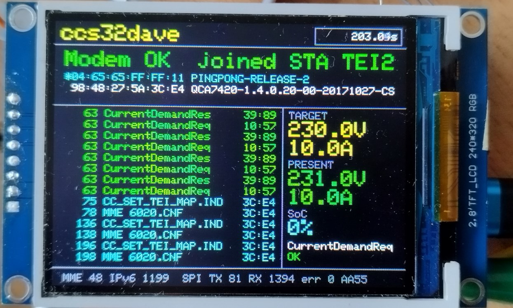
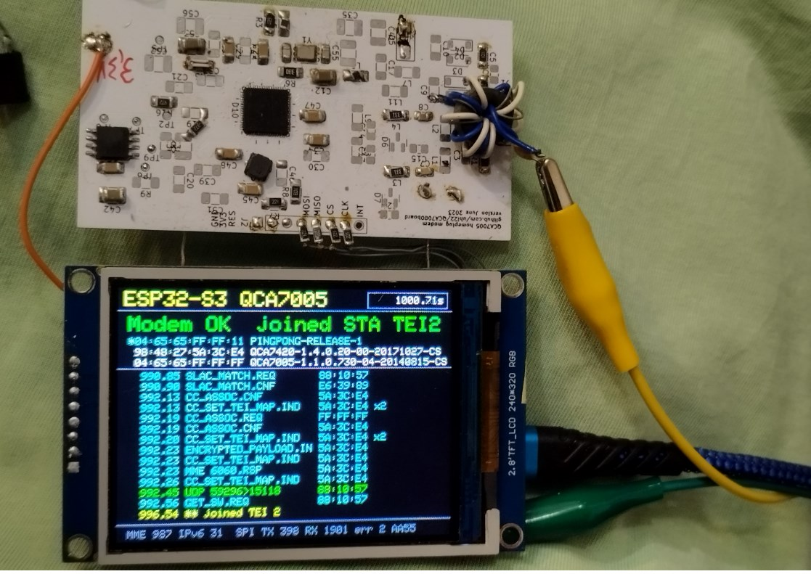

# ccs32dave - The CCS Sniffer with ESP32-S3, QCA7005 modem and TFT display





## News

- **Works in a real-world charging session:** sniffing tested successfully on a Hyundai Ioniq
  charging at an Alpitronic HYC300. See the [video on YouTube](https://www.youtube.com/watch?v=CvkjcjtfIfo).
- **Live DIN 70121 decode**, both directions: target/present voltage and
  current, SoC and the last message name and response code, updating in real time on the TFT.
- **Fully autonomous transparency:** the modem's own firmware (`PINGPONG-RELEASE-2`) now arms and
  maintains both-direction traffic forwarding by itself.
- **New two-column screen:** a prominent V2G value panel next to the frame log, plus a splash screen at boot (project name, GitHub link, build date, local modem version).
- **Beacon meter:** when not joined, shows whether a charger's modem (CCo) is in sight and how well its beacons are received.
- **Stale values fade out:** V2G values that are no longer updated turn gray.

## Description

Arduino project that drives an **ILI9341 SPI TFT** (240×320) and a **QCA7005 HomePlug Green PHY modem** (compatible with QCA7000) from an **ESP32-S3**. Passively decodes the ISO 15118 / DIN 70121 charging session between a car and a charger and shows the live values on the TFT.

At boot, a **splash screen** shows for ~5 s: project name, GitHub link, build date/time, and (if it answers in time) the local modem's own software version - then switches to the main screen below.

The main screen shows:

- The local modem's status (SPI signature)
- Whether the local modem has joined a powerline network, with its TEI and role (HomePlug `CM_NW_INFO`). If not joined: `beacons` plus a 5-segment meter while a CCo's beacons are received, otherwise `not joined`
- Up to 3 modems in the network with MAC and software version (HomePlug `GET_SW`). The local modem, whose MAC ends in `FF:FF:11`, is marked with `*`.
- Below the modem panel, two columns: a **frame log** on the left (events, MME/message names, UDP) and a prominent **V2G value panel** on the right - big stacked numbers for target/present voltage and current, SoC, the last decoded message name and its response code
- Traffic and SPI counters
- In the header: the uptime in seconds with **10 ms resolution**, refreshed every **50 ms** (20 Hz)

```
+-------------------------------------------------------+
| ccs32dave       (yellow, size 2)       [    1234.56s] |
|---------------------------------------------------------
| Modem OK (green/red)     joined STA TEI2  (size 2)     |
| *04:65:65:FF:FF:11 PINGPONG-RELEASE-2         (cyan)   |
|  98:48:27:5A:3C:E4 QCA7420-1.4.0.20-00-20171027-CS     |
|  04:65:65:FF:FF:FF QCA7005-1.1.0.730-04-20140815-CS    |
|------------------------------------|------------------|
| 12.3 ** modem OK             (yel) | TARGET     (grey)|
| 13.1 SLAC_PARAM.REQ    10:57 (cy)  | 230.0V   (yellow)|
| ...                                 | 10.0A    (yellow)|
| 16.0 SessionSetupReq   10:57 (grn) | PRESENT    (grey)|
| 16.1 CurrentDemandReq  10:57 (grn) | 230.0V    (green)|
| 16.1 CurrentDemandRes  39:89 (grn) | 10.0A     (green)|
|  ... (14 lines, newest at bottom)  | SoC        (grey)|
|                                     | 0%          (cy)|
|                                     | CurrentDemandRes |
|                                     | OK         (grn) |
|---------------------------------------------------------
| MME 42 IPv6 800  SPI TX 24 RX 1900 err 0 AA55  (grey)  |
+-------------------------------------------------------+
```

Planned next steps are in [backlog.md](backlog.md).

## Project layout

```
readme.md                                    this file
backlog.md                                   planned work
doc/                                         photos
qca-modem-firmware/                          the QCA7005's own firmware images, flashed via
                                              flashrom from the SPI-connected host - current:
                                              dut_flash_PINGPONG-RELEASE-2.bin (self-arming
                                              both-direction transparency); RELEASE-1 kept
                                              for reference, superseded
ccs32dave-arduino-esp32-s3-tft-ili9341.ino   Arduino sketch: display, splash screen, scheduling
qca7000.h/.cpp                               QCA7000/QCA7005 SPI driver
homeplug.h/.cpp                              HomePlug messages (GET_SW, NW_INFO, MME names,
                                              vendor MMEs VS_RD_MEM/VS_WR_MEM/VS_NW_INFO)
modem_list.h/.cpp                            table of the modems in the network
diag.h/.cpp                                  serial diagnosis interface (rd/wr/nwi/pp/stat/...)
v2gtp.h/.cpp                                 TCP reassembly + V2GTP framing (no TCP stack)
v2g_exi.h/.cpp                               DIN 70121 / app-handshake EXI decode glue
src/exi/                                     OpenV2G EXI codec (decoder-only), ported from
                                              ccs32berta - see backlog.md backlog_0001 step 2
```

The sketch folder is the repository root. Arduino requires the `.ino` file to have the same name as its folder.

The modem code is ported from [ccs32berta](https://github.com/uhi22/ccs32berta) and cleaned up into small C++ modules; so is the EXI codec in `src/exi/` (decoder-only - only the DIN and app-handshake decoders are used, not the encoders).

## Hardware

- ESP32-S3 board with an ESP32-S3-WROOM-1 module and two USB-C ports labeled "USB" and "COM" (DevKitC-1 style). Tested with this board.
- ILI9341 SPI TFT module **without CS and MISO**, with the 7 pins `GND VCC CLK MOSI RES DC BLK`. This is the same module as in the STM32 project `TFT-with-CAN`.
- QCA7005 (or QCA7000) HomePlug modem with SPI access (3.3 V logic)
- Jumper wires

## Wiring

The TFT and the modem use **two separate SPI buses**. The TFT has no CS, so it would react to the modem's SPI traffic.

### TFT display (FSPI bus)

| TFT pin | ESP32-S3 pin | Sketch define | Notes                                                    |
|---------|--------------|---------------|----------------------------------------------------------|
| GND     | GND          |               |                                                          |
| VCC     | 3V3          |               | Supply for the display controller                        |
| CLK     | GPIO 12      | `TFT_SCLK`    | FSPI SCK                                                 |
| MOSI    | GPIO 11      | `TFT_MOSI`    | FSPI MOSI                                                |
| RES     | GPIO 8       | `TFT_RST`     | Hardware reset                                           |
| DC      | GPIO 9       | `TFT_DC`      | Data/command select                                      |
| BLK     | 5V           | `TFT_BL = -1` | Backlight, always on. Or use a GPIO (see notes)          |
| *(CS)*  | –            | `TFT_CS = -1` | Not on the module                                        |
| *(MISO)*| –            | `TFT_MISO = -1` | Not on the module                                      |

The chosen GPIOs are free on every ESP32-S3 module variant. The wiring avoids GPIO 26–32 (SPI flash), GPIO 33–37 (octal PSRAM on N8R8 / N16R8 modules), GPIO 19/20 (USB D-/D+), GPIO 0/3/45/46 (strapping pins) and GPIO 43/44 (UART0, used by the "COM" port).

#### TFT notes

- **No CS:** the controller's chip select is tied active on the module, so the display must be the **only device on this SPI bus**. In the sketch, `TFT_CS` and `TFT_MISO` are set to `-1`, and the Adafruit driver then skips CS handling. The display is write-only, so MISO isn't needed.
- **SPI mode:** mode 0 (clock idle low, sample on the first edge), the same as in the STM32 project. The Adafruit driver uses mode 0 by default.
- **Backlight:** to switch the backlight from software, connect `BLK` to a free GPIO (e.g. GPIO 7) and set `#define TFT_BL 7` in the sketch. The backlight draws several tens of mA. If the module has no backlight transistor, use a small NPN/MOSFET switch instead of driving it directly from the GPIO.
- Keep the wires short (< 15 cm). The SPI clock runs at 40 MHz; the STM32 project used 18 MHz. If the picture shows glitches, lower `SPI_FREQUENCY` to `20000000`.
- To use different pins, change the `#define TFT_*` lines at the top of the sketch. The ESP32-S3 can route SPI to any free GPIO.

### QCA7005 modem (HSPI bus)

| QCA7005 pin | ESP32-S3 pin | Sketch define | Notes                          |
|-------------|--------------|---------------|--------------------------------|
| GND         | GND          |               |                                |
| SPI_CLK     | GPIO 4       | `QCA_SCLK`    |                                |
| SPI_SI      | GPIO 5       | `QCA_MOSI`    | ESP32 → modem                  |
| SPI_SO      | GPIO 6       | `QCA_MISO`    | Modem → ESP32                  |
| SPI_CS      | GPIO 15      | `QCA_CS`      | Active low                     |
| INT         | –            |               | Not connected; the sketch polls |

#### QCA7005 notes

- **SPI settings:** mode 3 (clock idle high) at 2 MHz, as in ccs32berta.
- **Supply:** check the modem board's supply voltage before connecting. The SPI lines must be 3.3 V logic.
- **No interrupt:** the sketch polls the modem's receive buffer every 10 ms instead of using INT.
- **Diagnosis:** if the display shows `Modem: missing`, the signature read didn't return `AA55`. `FFFF` or `0000` usually means a wiring problem (MISO, CS, CLK) or no supply. While the signature is wrong, the serial port prints all internal registers every second (`QCA regs: ...`). If they all have the same value, the modem isn't decoding the commands.
- **Tested with:** local QCA7005 running the special sniffer firmware `PINGPONG-RELEASE-2` (MAC `04:65:65:FF:FF:11`, self-arming both-direction transparency - forwards the traffic between the car and the charger to the host in both directions, on its own, without any external control), on a testbench with a PEV modem (QCA7005, `MAC-QCA7005-1.1.0.730-04-20140815-CS`) and an EVSE modem (QCA7420, `MAC-QCA7420-1.4.0.20-00-20171027-CS`). Serial output after a reset, once the local modem has joined the network:
  ```
  QCA7005 signature: AA55 (OK)
  ccs32dave started
  Modems: 1
    * 04:65:65:FF:FF:11 PINGPONG-RELEASE-2
  Network: joined, TEI 2, role 0
  Modems: 3
    * 04:65:65:FF:FF:11 PINGPONG-RELEASE-2
      98:48:27:5A:3C:E4 MAC-QCA7420-1.4.0.20-00-20171027-CS
      04:65:65:FF:FF:FF MAC-QCA7005-1.1.0.730-04-20140815-CS
  ```
  At the start of each new charging session the local modem resets, and the signature reads `0000` for up to 1 s.

## Software

### Requirements

- Arduino IDE 2.x **or** just `arduino-cli`. The IDE isn't needed; see [Command line only](#command-line-only-no-arduino-ide)
- **esp32** board package by Espressif, version 3.x (tested with 3.0.2)
- Libraries, from the Library Manager:
  - **Adafruit ILI9341** (tested with 1.6.3)
  - **Adafruit GFX Library** (tested with 1.12.6)
  - **Adafruit BusIO**, which is installed automatically as a dependency

The sketch uses the Adafruit libraries rather than TFT_eSPI. TFT_eSPI has known compatibility problems with esp32 core 3.x on the ESP32-S3.

### Board settings (Arduino IDE)

- Board: **ESP32S3 Dev Module**
- Everything else can stay at the defaults

### USB port

Connect the board's **"COM"** USB-C port. It has a USB-to-serial chip on UART0, which:

- puts the ESP32 into download mode automatically, so you don't need to press BOOT/RESET
- shows `Serial` output without the "USB CDC On Boot" setting
- stays available when the sketch crashes

The "USB" port is the ESP32-S3's native USB and isn't needed here. If Windows shows no COM port, install the driver for the USB-to-serial chip (CH343 or CP210x).

### Command line only (no Arduino IDE)

Everything (setup, build, upload, serial monitor) works with `arduino-cli` alone.

**1. Install arduino-cli**

```sh
winget install ArduinoSA.CLI
```

Or download it from <https://arduino.github.io/arduino-cli/latest/installation/>. If the Arduino IDE 2.x is already installed, it contains a copy of the CLI:
`%LOCALAPPDATA%\Programs\Arduino IDE\resources\app\lib\backend\resources\arduino-cli.exe`

**2. Install the ESP32 board package and the libraries** (one time)

```sh
arduino-cli config init
arduino-cli config add board_manager.additional_urls https://espressif.github.io/arduino-esp32/package_esp32_index.json
arduino-cli core update-index
arduino-cli core install esp32:esp32
arduino-cli lib install "Adafruit ILI9341" "Adafruit GFX Library"
```

`arduino-cli config init` fails if a config file already exists, e.g. because the Arduino IDE created one. That's fine: continue with the next command. To get the tested version, use `esp32:esp32@3.0.2`.

#### Already set up on the dev/bench PC (2026-09-15)

Everything above is already installed on the Windows machine this project is normally worked on
from (`C:\UwesTechnik\...`) - no need to (re-)install, just use these paths directly:

- `arduino-cli.exe`: `C:\Users\uwemi\AppData\Local\Programs\Arduino IDE\resources\app\lib\backend\resources\arduino-cli.exe`
  (bundled with Arduino IDE 2.x, no separate `arduino-cli` install)
- Board package: `esp32:esp32` 3.0.2, in the default `Arduino15` data dir (`arduino-cli core list` to confirm)
- Libraries: **not** in the default `Documents\Arduino\libraries` - this account's Documents is
  OneDrive-redirected, so they're under
  `C:\Users\uwemi\OneDrive\Dokumente\Arduino\libraries\` (`Adafruit_GFX_Library` 1.12.6,
  `Adafruit_BusIO` 1.17.4, `Adafruit_ILI9341` 1.6.3 - `arduino-cli lib list` to confirm/update)
- Compile-check (no upload, no board needed - use this to verify a change before touching hardware):
  ```sh
  "C:\Users\uwemi\AppData\Local\Programs\Arduino IDE\resources\app\lib\backend\resources\arduino-cli.exe" compile --fqbn esp32:esp32:esp32s3 "C:\UwesTechnik\ccs32dave-arduino-esp32-s3-tft-ili9341"
  ```
- The ESP32 is on **COM11** on this bench (fixed, not just the doc's placeholder value) - confirm with `arduino-cli board list` if it's been replugged.

**3. Build and upload**

Run these commands in the sketch folder `ccs32dave-arduino-esp32-s3-tft-ili9341`:

```sh
arduino-cli board list
arduino-cli compile --upload -p COM11 --fqbn esp32:esp32:esp32s3 .
```

Replace `COM11` with the port shown by `arduino-cli board list`. The FQBN `esp32:esp32:esp32s3` is the "ESP32S3 Dev Module" from the IDE, with the default settings.

**4. Serial monitor**

```sh
arduino-cli monitor -p COM11 -c baudrate=115200
```

After a reset it shows `ESP32-S3 TFT + QCA7005 demo started`. Exit with Ctrl+C. Close any serial monitor (CLI or IDE) before uploading, because it blocks the port.

## How it works

### Startup

`setup()` starts the TFT on the FSPI bus (40 MHz, landscape 320×240), then calls `showSplashScreen()`
(project name, GitHub link, build date/time, ~5 s, also starts the modem on the HSPI bus and tries
to catch its own `GET_SW.CNF` within that window - see "Splash screen" below), draws the static
labels, and does the first modem check.

### Main loop

`loop()` is a small non-blocking scheduler:

| Interval | Task |
|---|---|
| 1 s | `checkModem()`: reads the signature register (`0xAA55` = modem present). If the modem disappears, the modem table and network status are cleared. When it comes back, the requests are sent immediately. |
| 5 s | `sendRequests()`: sends a broadcast `GET_SW.REQ`, a broadcast `CM_NW_INFO.REQ` and `VS_SNIFFER.REQ` (sniffer on if no SLAC or IP traffic for 5 s, otherwise off), unless `bcast 0` was sent on the serial port (`diag`). Modems and network info that didn't answer for 3 cycles (15.5 s) are removed. |
| 10 ms | `qca.poll()`: if the modem reports received data (`RDBUF_BYTE_AVA`), reads it, splits it into Ethernet frames and passes each one to `onEthFrame()` (see below) |
| per poll | `diag.loop()`: serial diagnosis commands (`rd`/`wr`/`nwi`/`pp`/`stat`/`qreset`/`bcast`/`log`) |
| every pass | `updateBeaconActive()`: beacon label on/off and meter level; redraws right away on a change (max. 200 ms from beacon to screen) |
| 50 ms | Uptime display |
| on change, and every 500 ms | `drawPanel()`: redraws only the text lines whose content or color changed (the 500 ms tick lets stale values fade) |
| on change, max. every 200 ms | `drawLog()`: redraws the frame log |

`onEthFrame()` first offers the frame to `diag` (answers to a pending serial command are consumed
there, not shown as traffic), then sorts the rest:

- **`GET_SW.CNF`:** added to the modem table. Once the local modem has joined a network, every modem in it answers.
- **`CM_NW_INFO.CNF`:** only the answer of the local modem sets the join status (number of networks > 0 means joined).
- **`VS_SNIFFER` (`0xA034`-`0xA036`):** not logged and not counted as traffic. Of the `.IND`s, only
  beacons the modem received count for the beacon display; the stream also reports the modem's own
  transmissions.
- **Other HomePlug MMEs:** counted and added to the frame log (e.g. `SLAC_MATCH.CNF`).
- **IPv6 UDP:** counted, protocol and ports added to the frame log (e.g. `UDP 59230>15118` = SDP).
- **IPv6 TCP:** payload handed to the V2GTP reassembler (`v2gtp`); a completed message goes to the
  EXI decoder (`v2g_exi`) and the result (message name, and any of target/present V+A, SoC, response
  code it carries) updates the TFT. Individual TCP segments (mostly bare ACKs) are not logged on the
  TFT - only UDP frames and decoded/failed V2G messages are, to keep the 12-line ring buffer useful.

Every counted frame's raw description is printed on the serial port unconditionally via
`logFrame()` (command `log 0` turns this off); it includes TCP flags/sequence/payload-length/V2GTP-
length for TCP. Changes of the modem table, join status, and the shown V2G values are always
printed, independent of that setting (same convention: print on change, not on every event).

### Modules

- **`qca7000`:** SPI protocol of the modem (chargebyte AN4). Internal register reads/writes
  (`readRegister()` is public - used by the splash screen and `diag`'s `stat` command), a soft
  reset via `SPI_CONFIG`'s `SLAVE_RESET` bit (`qreset` - only clears the SPI buffers, not the CPU;
  a wedged QCA needs a real reset line pulse), and the framing `AA AA AA AA | length | 00 00 |
  frame | 55 55` for sending and receiving Ethernet frames. It counts TX/RX/rejected frames and
  errors.
- **`homeplug`:** builds `GET_SW.REQ` (Qualcomm vendor MME `0xA000`, OUI `00:B0:52`) and `CM_NW_INFO.REQ` (`0x6038`, MMV 1), plus the vendor MMEs `VS_RD_MEM`/`VS_WR_MEM`/`VS_NW_INFO` (`0xA008`/`0xA004`/`0xA038`) used by `diag` to talk to a specially patched local modem over SPI instead of Ethernet, and `VS_SNIFFER.REQ` (`0xA034`, stock firmware) with a check for received beacon indications. It parses the matching `.CNF`s, and turns MMTYPEs into readable names.
- **`modem_list`:** table of up to 3 modems, keyed by MAC, with the local modem always first. Entries expire when a modem stops answering.
- **`diag`:** serial command interface (see its own header for the command list) - the diagnosis
  channel for a modem that has no other host link (no JTAG, no Ethernet to the QCA on this board).
- **`v2gtp`:** TCP reassembly + V2GTP message framing, keyed by source MAC, without a TCP stack.
- **`v2g_exi`:** decodes one complete EXI payload (DIN 70121, or the app-handshake) using the ported
  OpenV2G codec in `src/exi/`.

### Splash screen

`showSplashScreen()` runs once at boot, for 5 s (`SPLASH_DURATION_MS`): a bordered screen with a
typewriter-revealed title ("ccs32dave"), subtitle, the GitHub link, the build date/time
(`__DATE__ __TIME__`), a progress bar filling over the 5 s, and two pulsing lightning-bolt icons.
It also starts the QCA link (`qca.begin()`) and, as soon as the signature reads OK, sends one
`GET_SW.REQ` and polls for the local modem's own answer for the rest of the window - if it arrives,
"Local modem: detecting..." is replaced with the real version string and the modem table is seeded
with it, so the main screen shows it immediately without an extra wait. Purely cosmetic and
blocking - nothing else needs to run during it.

### Display

- **Status and modem lines:** each line is padded to its full width and drawn with a background color, so old text is erased without clearing the screen.
- **Two-column layout below the modem panel** (owner request 2026-09-15, replacing an earlier
  two-line design): a vertical divider splits the remaining screen into the frame log (left) and a
  V2G value panel (right). The log gave up width for this - see below - so the panel could give the
  numbers real prominence instead of squeezing them into shared text lines.
- **V2G value panel:** "big stacked numbers" - a size-1 label above each size-2 value: `TARGET`
  voltage+current (yellow, from the car's `CurrentDemandReq`), `PRESENT` voltage+current (green,
  from the charger's `CurrentDemandRes`/`PreChargeRes`), `SoC` (cyan), the last decoded message name
  (green = decoded OK, red = a decode error), and its response code (blank until known, `OK` in
  green, `RC <n>` in red for any fault code - see `dinresponseCodeType` in
  `src/exi/dinEXIDatatypes.h` for the full list). Values persist across messages (e.g.
  `CurrentDemandRes` doesn't repeat the target values) until a newer message updates them. A value
  not updated for 2 s turns mid-gray, after 4 s dark gray. Each row is its own `TextLine`, so only
  the ones that actually changed get redrawn.
- **Beacon meter:** when not joined, the network line shows `beacons` (orange) and 5 segments, one
  per beacon received in the last ~200 ms (a CCo beacons every 40 ms, so 5 = all received). It goes
  back to `not joined` 150 ms after the last beacon. The sniffer is switched on during the splash
  screen already, so the meter works as soon as the main screen appears.
- **Frame log:** a ring buffer of 14 entries, narrowed (not shortened) to make room for the panel:
  uptime in whole seconds, MME/message name (still the full 20 characters it always had), and the
  last **2** bytes of the source MAC (was 3 - the extra byte wasn't worth the width once the panel
  needed it more). Consecutive identical entries are combined (`x10`, may get silently clipped by
  the narrower canvas on a very repetitive line - cosmetic only). Events (modem OK/missing,
  joined/not joined) are shown in yellow; decoded V2G messages in green, decode errors in red. The
  log is rendered into a `GFXcanvas16` sized to the narrowed column and sent as one bitmap, at most
  every 200 ms.
- **Uptime:** read from `esp_timer_get_time()`, which is 64-bit microseconds, so it doesn't overflow after 49 days like `millis()`. The fixed-width string `%8llu.%02us` is rendered into a 72×8 canvas and sent in one `drawRGBBitmap()` call. This avoids flicker.

## References

- [Ref1] Discussion of this project on the openinverter forum: https://openinverter.org/forum/viewtopic.php?t=7346
- [Ref2] YouTube  video of a real-world charging session (Hyundai Ioniq at Alpitronic HYC300): https://www.youtube.com/watch?v=CvkjcjtfIfo
- [Ref3] Prior work, pyPLC, the open source CCS communication solution: https://github.com/uhi22/pyPLC
- [Ref4] The openinverter forum thread where all the CCS open source work started: https://openinverter.org/forum/viewtopic.php?t=2262
